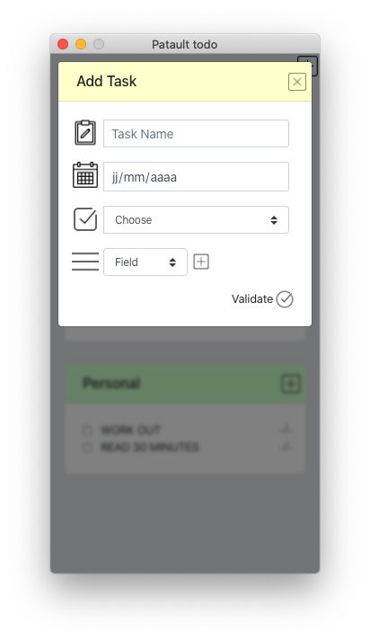

# Patault ToDo

This is my version of a ToDoList. 

Desktop application made with [ElectronJS](https://www.electronjs.org/), HTML, CSS and Javascript.

## Installation

Clone this repository, then run :

```bash
$ npm install 
$ npm start
```

## Distribution

### Packaging (macOS only)

```bash
$ npm run package-mac 
```

### Installer (macOS only)
```bash
$ npm run create-installer-mac
```

## Preview



## License
[MIT](https://choosealicense.com/licenses/mit/)