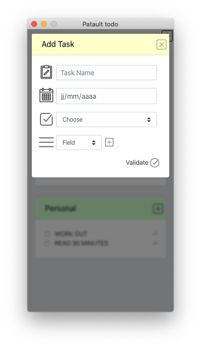

# Patault ToDo

This is my version of a ToDoList. 
Desktop application made with ElectronJS, html, css and javascript.

## Installation

Clone this repository, then run :

```bash
npm install 
npm start
```

## Preview



## License
[MIT](https://choosealicense.com/licenses/mit/)